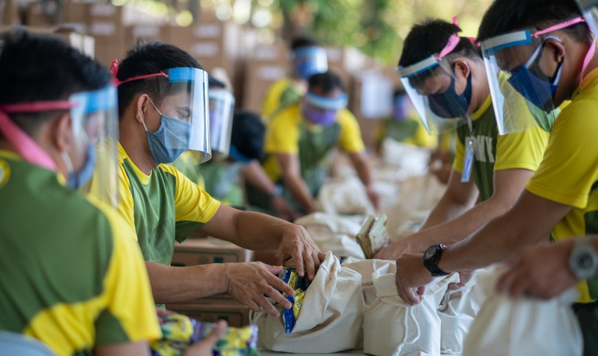
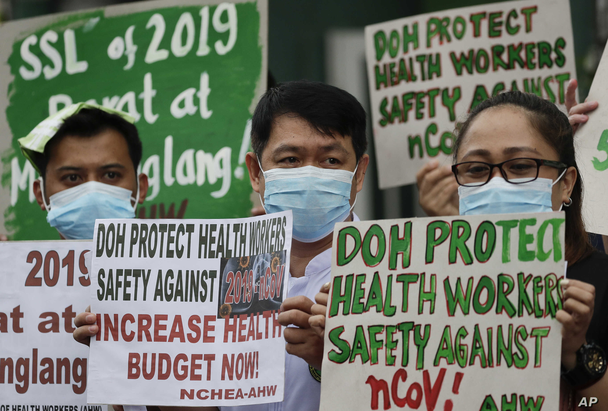

<html>
  <head>
    <meta charset="utf-8">
     <link rel="stylesheet" type="text/css" href="HomePage.css">
  </head>
  <body>
    
	  <h1 id="HomePageTitle">Duterte Administration Response to Covid-19<h1>
	  <a id="Link1" href="file:///C:/Users/Lenovo/Documents/(A_Kcccccc)/ComSci%20Z-PROJECT/Calcium_Lozano_1qproj_v1Final/htdocs/Content%20Page.html"> > More Information on Covid-19 in the Philippines</a>
	  

		  <h1 id="title">What Makes Covid-19 so Devastating?</h1>
		  
The Philippines is just one of the countries that have definitely taken a huge beating in their economy 
		  when the Covid-19 virus first swept the world. The Covid-19 virus itself is not as deadly as other diseases but instead have fairly subtle signs upon being infected. This    means that tracking people that have contracted this virus and have infected others is a very difficult thing to do especially since this is virus is highly infectious. This makes Philippines a great target of the virus since we are geologically close to China which was the centre of Covid-19 cases. Together with our dense population and late response, it's no surprise that the Philippines have one of the worst situations during this pandemic.

	  

	

	  
	
	
	

	
By: Karla Christine V. Lozano    |    9 - Calcium

  </body>
</html>
